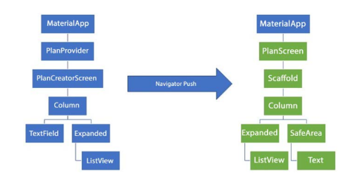
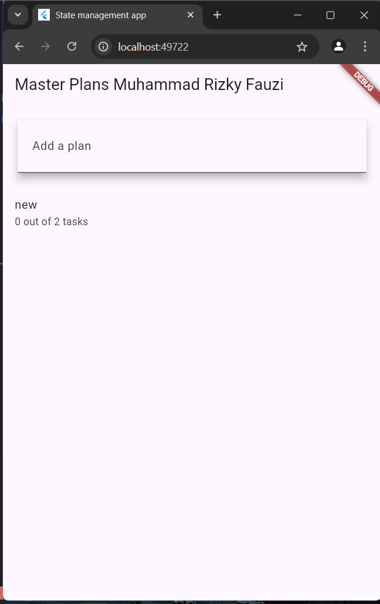

### Muhammad Rizky Fauzi
### TI-3B / 21

# Praktikum 1
## Jelaskan maksud dari langkah 4 pada praktikum tersebut! Mengapa dilakukan demikian?
Fungsi dari export ini adalah untuk membuat file yang menggabungkan beberapa file lainnya, sehingga dapat mengimpor semuanya sekaligus dari satu file. Ini berguna untuk organisasi kode dan kemudahan pengelolaan.

## Mengapa perlu variabel plan di langkah 6 pada praktikum tersebut? Mengapa dibuat konstanta?
Variabel plan digunakan untuk menyimpan dan mengelola data rencana (plan) yang berisi daftar tugas (tasks). const digunakan untuk menunjukkan bahwa objek Plan yang diciptakan adalah immutable (tidak bisa diubah) dan nilainya sudah diketahui pada waktu kompilasi.

## Lakukan capture hasil dari Langkah 9 berupa GIF, kemudian jelaskan apa yang telah Anda buat!

Fungsi _buildTaskTile bertanggung jawab untuk menampilkan setiap item tugas (Task) dalam bentuk widget ListTile pada layar.

## Apa kegunaan method pada Langkah 11 dan 13 dalam lifecyle state ?
initState() adalah metode yang dipanggil sekali, ketika widget pertama kali dibuat. Metode ini biasanya digunakan untuk menginisialisasi data atau mempersiapkan objek yang diperlukan selama widget aktif.
dispose() adalah metode yang dipanggil ketika widget dihapus dari widget tree secara permanen, atau lebih tepatnya ketika instance dari State akan dihancurkan.

# Praktikum 2
## Jelaskan mana yang dimaksud InheritedWidget pada langkah 1 tersebut! Mengapa yang digunakan InheritedNotifier?
PlanProvider merupakan turunan dari InheritedNotifier. InheritedNotifier dipilih daripada InheritedWidget karena kebutuhan untuk merespon perubahan data secara dinamis. Dengan menggunakan InheritedNotifier, aplikasi mendapatkan keuntungan dari Listenable yang memberi tahu widget untuk rebuild hanya ketika nilai di ValueNotifier berubah. Ini lebih efisien daripada menggunakan InheritedWidget murni karena InheritedNotifier tidak akan memaksa semua widget di bawahnya untuk rebuild secara keseluruhan, melainkan hanya yang mendengarkan perubahan data.

## Jelaskan maksud dari method di langkah 3 pada praktikum tersebut! Mengapa dilakukan demikian?
- completedCount menghitung jumlah tugas yang sudah selesai (complete).
- completenessMessage membuat pesan teks yang menunjukkan berapa banyak tugas yang sudah selesai dibandingkan dengan total tugas.

## Lakukan capture hasil dari Langkah 9 berupa GIF, kemudian jelaskan apa yang telah Anda buat!
 Pada Praktikum ini kita melakukan manajemen tugas sederhana menggunakan Flutter dengan pola State Management berbasis InheritedNotifier. Setiap perubahan pada data (misal: menambah atau mengubah tugas) akan otomatis memperbarui UI tanpa perlu kode tambahan untuk state management manual.

# Praktikum 3
## Berdasarkan Praktikum 3 yang telah Anda lakukan, jelaskan maksud dari gambar diagram berikut ini!
      
Pada diagram tersebut, pengguna sedang melakukan navigasi dari layar PlanCreatorScreen ke layar PlanScreen dengan menggunakan Navigator.push(). Hasilnya, PlanScreen ditampilkan di atas PlanCreatorScreen pada struktur widget aplikasi.

## Lakukan capture hasil dari Langkah 14 berupa GIF, kemudian jelaskan apa yang telah Anda buat!
        
Pada praktikum ini membangun aplikasi untuk mengelola rencana (Plan) dan tugas-tugasnya (Task) dengan menggunakan State Management menggunakan ValueNotifier dan InheritedNotifier di Flutter.