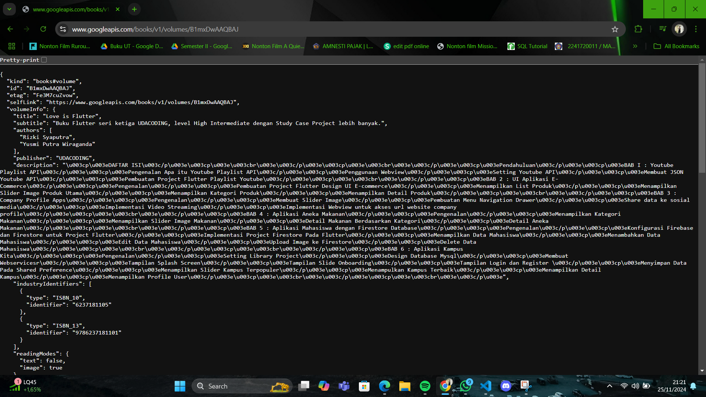
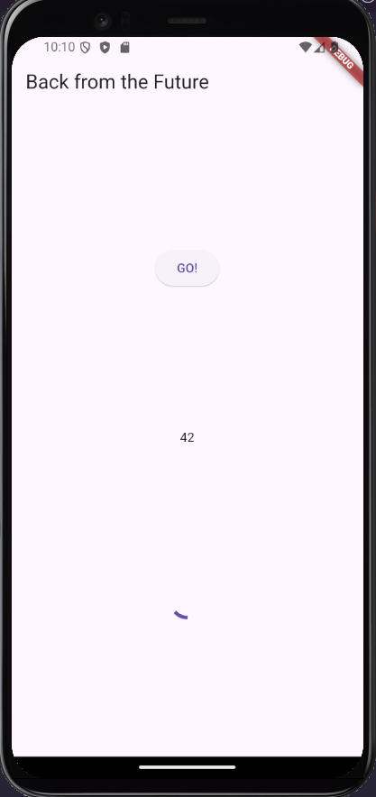
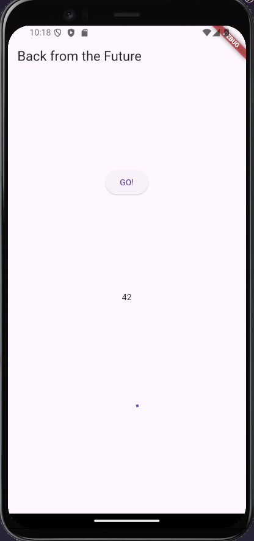
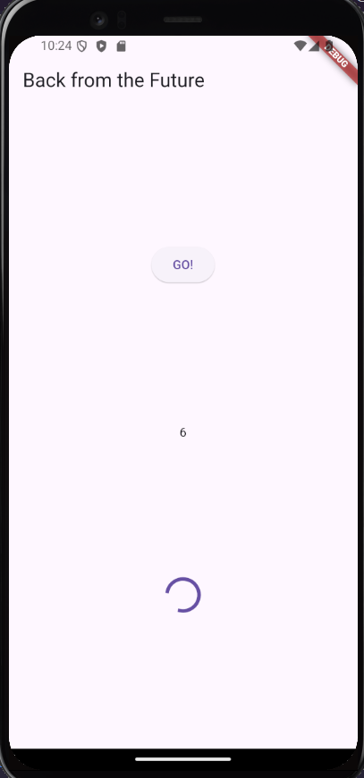

### Muhammad Rizky Fauzi
### TI-3B / 21

# 11 | Pemrograman Asynchronous
## Praktikum 1
### Soal 1

### Soal 2

### Soal 3

- substring(0, 450) mengambil potongan teks dari indeks ke-0 hingga ke-449.
- .catchError((_) { ... }) digunakan untuk menangani error yang terjadi selama proses getData().        

## Praktikum 2
### Soal 4

- Ketiga method (returnOneAsync, returnTwoAsync, dan returnThreeAsync) adalah fungsi asynchronous yang masing-masing mengembalikan nilai integer (1, 2, dan 3). Setelah delay selama 3 detik, masing-masing fungsi akan mengembalikan nilai integer (1, 2, atau 3).
- Method count() adalah fungsi asynchronous yang digunakan untuk menghitung total dari hasil ketiga fungsi di atas.

## Praktikum 3
### Soal 5

- Kode ini menggunakan Completer untuk mengontrol kapan sebuah Future selesai. Fungsi getNumber() membuat Completer<int>, memanggil calculate(), dan mengembalikan Future yang belum selesai. Fungsi calculate() menunggu 5 detik dengan Future.delayed, lalu menyelesaikan Future tersebut dengan nilai 42 menggunakan completer.complete(42). Hasilnya, Future yang dikembalikan oleh getNumber() akan selesai dengan nilai 42 setelah 5 detik, memungkinkan kontrol manual atas penyelesaian Future tersebut.

### Soal 6

- Perbedaan antara langkah 2 dan langkah 5-6 ada di Error Handler. Pada langkah 2, method calculate() hanya menyelesaikan Future dengan nilai 42 setelah 5 detik tanpa penanganan error. Sementara itu, pada langkah 5, calculate() menggunakan blok try-catch, sehingga jika terjadi error, completer.completeError({}) akan dipanggil untuk menandai Future sebagai gagal. Di langkah 6, onPressed() diperbarui untuk menangani keberhasilan dengan then() yang menampilkan hasil, atau catchError() untuk menampilkan pesan error, sehingga aplikasi dapat menampilkan respons yang sesuai tergantung pada apakah Future berhasil atau gagal.

## Praktikum 4
### Soal 7
