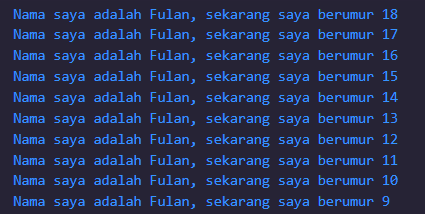

### Nama : Muhammad Rizky Fauzi
### Kelas : TI-3B / 21

Soal 1  
Modifikasilah kode pada baris 3 di VS Code atau Editor Code favorit Anda berikut ini agar mendapatkan keluaran (output) sesuai yang diminta!
```dart
void main() {
  for (int i=0; i<10; i++) {
    print('hello ${i+2}');
  }
}
```

Output yang diminta:

```dart
void main() {
  for (int i=18; i>8; i--) {
    print('Nama saya adalah Fulan, sekarang saya berumur ${i}');
  }
}
```



Soal 2  
Mengapa sangat penting untuk memahami bahasa pemrograman Dart sebelum kita menggunakan framework Flutter ? Jelaskan!    
Jawab :     
Karena memahami bahasa pemrograman Dart sangat penting sebelum menggunakan framework Flutter karena Dart adalah bahasa utama yang digunakan untuk menulis aplikasi Flutter. Menguasai Dart memberi Anda dasar yang kuat dalam sintaksis, konsep pemrograman berorientasi objek, dan pengelolaan memori, yang semuanya esensial dalam pengembangan aplikasi Flutter


Soal 3  
Rangkumlah materi dari codelab ini menjadi poin-poin penting yang dapat Anda gunakan untuk membantu proses pengembangan aplikasi mobile menggunakan framework Flutter.  
Jawab :     
Dart adalah bahasa pemrograman modern yang menggabungkan berbagai fitur unggulan seperti alat produktivitas yang kuat, manajemen memori otomatis melalui garbage collection, anotasi tipe yang opsional, serta sistem tipe yang aman (type-safe) dan kemampuan portabilitas yang tinggi. Bahasa ini dirancang untuk mendukung pengembangan aplikasi di berbagai platform, termasuk web, mobile, dan desktop, serta menjadi fondasi dari framework Flutter yang populer. Oleh karena itu, memahami Dart sangat penting untuk memastikan pengembangan yang efisien dan optimal saat menggunakan Flutter.

Di Dart, operator adalah method khusus yang didefinisikan dalam class. Misalnya, saat Anda menggunakan operator x == y, Dart sebenarnya memanggil method x.==(y). Hal ini berbeda dengan bahasa pemrograman lain seperti Java yang membedakan antara tipe data primitif dan objek, karena di Dart, semua tipe data adalah objek. Selain itu, operator di Dart dapat dimodifikasi atau di-overload sesuai kebutuhan, memungkinkan fleksibilitas dalam pengembangan. Dart juga menyediakan operator aritmatika umum seperti + untuk penjumlahan dan - untuk pengurangan, yang dapat digunakan langsung pada objek.

Fungsi utama dalam Dart adalah main, yang memiliki beberapa karakteristik khusus. Pertama, tipe data kembalian fungsi ini adalah void, yang menunjukkan bahwa fungsi tidak mengembalikan nilai apapun. Kedua, nama fungsi main adalah standar yang digunakan oleh Dart VM (Virtual Machine) untuk memulai eksekusi kode. Ketiga, tanda kurung kosong () menunjukkan bahwa fungsi main tidak menerima parameter. Terakhir, kurung kurawal { } digunakan untuk menentukan awal dan akhir dari blok kode yang dijalankan oleh fungsi tersebut.

Selain itu, penting untuk memahami perbedaan antara fungsi dan method di Dart. Fungsi adalah unit kode yang berada di luar sebuah class dan dapat dipanggil secara global. Contoh yang paling umum adalah fungsi main, yang merupakan fungsi global yang menjadi titik masuk aplikasi. Di sisi lain, method adalah fungsi yang didefinisikan di dalam class dan beroperasi pada instance dari class tersebut. Memahami perbedaan ini penting dalam penulisan kode Dart yang bersih dan terstruktur.


Soal 4  
Buatlah slide yang berisi penjelasan dan contoh eksekusi kode tentang perbedaan Null Safety dan Late variabel ! (Khusus soal ini kelompok berupa link google slide)
- Null Safety adalah fitur dalam Dart yang dirancang untuk membantu mencegah terjadinya runtime errors yang disebabkan oleh null pointer exceptions. Di banyak bahasa pemrograman, kesalahan yang terjadi ketika mencoba mengakses properti atau metode dari objek yang bernilai null adalah sumber umum bug yang sulit dideteksi. Null safety di Dart memaksa pengembang untuk secara eksplisit menangani kemungkinan nilai null, sehingga meningkatkan keamanan dan keandalan kode.

- Late variable adalah fitur dalam Dart yang memungkinkan Anda untuk mendeklarasikan variabel yang akan diinisialisasi nanti, tetapi tetap memastikan bahwa variabel tersebut harus diinisialisasi sebelum digunakan. Fitur ini sangat berguna ketika Anda tidak dapat langsung menyediakan nilai awal untuk sebuah variabel, tetapi Anda yakin bahwa nilai tersebut akan diberikan sebelum variabel tersebut digunakan.

Kumpulkan jawaban Anda di spreadsheet pada tautan yang telah disediakan di grup telegram. Untuk soal nomor 1 sampai 3 push repo GitHub Anda.