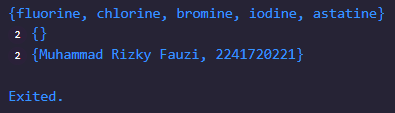
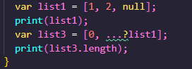
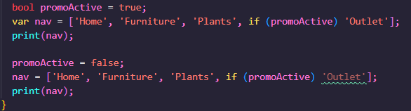
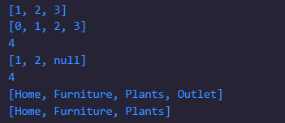
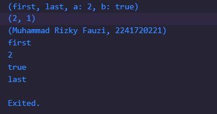

### Nama    : Muhammad Rizky Fauzi
### Kelas   : TI-3B / 21

## Praktikum 1: Eksperimen Tipe Data List
Langkah 1:
Ketik atau salin kode program berikut ke dalam void main().
```dart
var list = [1, 2, 3];
assert(list.length == 3);
assert(list[1] == 2);
print(list.length);
print(list[1]);

list[1] = 1;
assert(list[1] == 1);
print(list[1]);
```
Langkah 2:
Silakan coba eksekusi (Run) kode pada langkah 1 tersebut. Apa yang terjadi? Jelaskan!
      
Jawab :     
Fungsi assert akan memastikan kondisi boolean pada ketentuan yang diminta bernilai true. Apabila ternyata bernilai false, maka kode akan terhenti dan menampilkan pesan error seperti ini.

Langkah 3:
Ubah kode pada langkah 1 menjadi variabel final yang mempunyai index = 5 dengan default value = null. Isilah nama dan NIM Anda pada elemen index ke-1 dan ke-2. Lalu print dan capture hasilnya.
Apa yang terjadi ? Jika terjadi error, silakan perbaiki.        
Jawab :     
        
Jawab :     
Terjadi error karena variabel final list terdeteksi sebagai List<Null> (array dengan tipe data null).       
Seharusnya kita juga harus definisikan tipe datanya setelah sintaks final menjadi:      
```dart
void main() {
  // final list = [null, null, null, null, null];
  final List<String?> list = [null, null, null, null, null];
  list[1] = 'Muhammad Rizky Fauzi';
  list[2] = '2241720221';
  print(list);
}
```
Hasil :     


## Praktikum 2: Eksperimen Tipe Data Set
Langkah 1:
Ketik atau salin kode program berikut ke dalam fungsi main().
```dart
var halogens = {'fluorine', 'chlorine', 'bromine', 'iodine', 'astatine'};
print(halogens);
```
Langkah 2:
Silakan coba eksekusi (Run) kode pada langkah 1 tersebut. Apa yang terjadi? Jelaskan! Lalu perbaiki jika terjadi error.     
        
Jawab :     
Menampilkan nilai dari variabel halogens berupa set.

Langkah 3:
Tambahkan kode program berikut, lalu coba eksekusi (Run) kode Anda.
```dart
var names1 = <String>{};
Set<String> names2 = {}; // This works, too.
var names3 = {}; // Creates a map, not a set.

print(names1);
print(names2);
print(names3);
```
Apa yang terjadi ? Jika terjadi error, silakan perbaiki namun tetap menggunakan ketiga variabel tersebut. Tambahkan elemen nama dan NIM Anda pada kedua variabel Set tersebut dengan dua fungsi berbeda yaitu .add() dan .addAll(). Untuk variabel Map dihapus, nanti kita coba di praktikum selanjutnya.       
        
        
Jawab :     
Fungsi .add() akan menambahkan 1 value saja (dalam konteks ini adalah String) sedangkan .addAll() akan menambahkan 1 atau lebih value berupa Set (dalam konteks ini adalah Set<String>).

## Praktikum 3: Eksperimen Tipe Data Maps
Langkah 1:
Ketik atau salin kode program berikut ke dalam fungsi main().
```dart
var gifts = {
  // Key:    Value
  'first': 'partridge',
  'second': 'turtledoves',
  'fifth': 1
};

var nobleGases = {
  2: 'helium',
  10: 'neon',
  18: 2,
};

print(gifts);
print(nobleGases);
```
Langkah 2:
Silakan coba eksekusi (Run) kode pada langkah 1 tersebut. Apa yang terjadi? Jelaskan! Lalu perbaiki jika terjadi error.     
        
Jawab :     
Menampilkan nilai dari variabel gifts dan nobleGases berupa maps.

Langkah 3:
Tambahkan kode program berikut, lalu coba eksekusi (Run) kode Anda.
```dart
var mhs1 = Map<String, String>();
gifts['first'] = 'partridge';
gifts['second'] = 'turtledoves';
gifts['fifth'] = 'golden rings';

var mhs2 = Map<int, String>();
nobleGases[2] = 'helium';
nobleGases[10] = 'neon';
nobleGases[18] = 'argon';
```
Apa yang terjadi ? Jika terjadi error, silakan perbaiki.

Tambahkan elemen nama dan NIM Anda pada tiap variabel di atas (gifts, nobleGases, mhs1, dan mhs2).
```dart
void main() {
  var gifts = {
    // Key:    Value
    'first': 'partridge',
    'second': 'turtledoves',
    'fifth': 1
  };

  var nobleGases = {
    2: 'helium',
    10: 'neon',
    18: 2,
  };

  print(gifts);
  print(nobleGases);

  var mhs1 = Map<String, String>();
  gifts['first'] = 'partridge';
  gifts['second'] = 'turtledoves';
  gifts['fifth'] = 'golden rings';

  var mhs2 = Map<int, String>();
  nobleGases[2] = 'helium';
  nobleGases[10] = 'neon';
  nobleGases[18] = 'argon';

  mhs1.addAll({
    'nama': 'Muhammad Rizky Fauzi',
    'nim': '2241720221',
  });
  mhs2.addAll({
    26: 'Muhammad Rizky Fauzi',
    34: '2241720221',
  });
  gifts.addAll({
    'nama': 'Muhammad Rizky Fauzi',
    'nim': '2241720221',
  });
  nobleGases.addAll({
    26: 'Muhammad Rizky Fauzi',
    34: '2241720221',
  });

  print(mhs1);
  print(mhs2);
  print(gifts);
  print(nobleGases);
}
```
        
Jawab :     
Menambahkan value ke dalam maps menggunakan fungsi .addAll().

## Praktikum 4: Eksperimen Tipe Data List: Spread dan Control-flow Operators
Langkah 1:
Ketik atau salin kode program berikut ke dalam fungsi main().
```dart
var list = [1, 2, 3];
var list2 = [0, ...list];
print(list1);
print(list2);
print(list2.length);
```
Langkah 2:
Silakan coba eksekusi (Run) kode pada langkah 1 tersebut. Apa yang terjadi? Jelaskan! Lalu perbaiki jika terjadi error.
        
Jawab :     
Terjadi error karena tidak ditemukan variabel list1. Dapat diperbaiki dengan mengganti var list menjadi var list1 atau print(list1) menjadi print(list).        
Diperbaiki menjadi  :       
       
        

Langkah 3:
Tambahkan kode program berikut, lalu coba eksekusi (Run) kode Anda.
```dart
list1 = [1, 2, null];
print(list1);
var list3 = [0, ...?list1];
print(list3.length);
```
Apa yang terjadi ? Jika terjadi error, silakan perbaiki.
Tambahkan variabel list berisi NIM Anda menggunakan Spread Operators.       
       
Dapat diatasi dengan mendeklarasikan tipe data dari variabel list1
       
       
Operator ...? (null-aware spread operator) digunakan untuk mencegah penyebaran objek null, tetapi hanya pada keseluruhan list yang null. Jika ada elemen null di dalam list, itu tidak akan ditangani oleh operator tersebut, sehingga tetap terjadi error.
Untuk mengatasi ini, bisa dengan mengganti elemen null dengan nilai yang valid, atau memfilter nilai null sebelum menyebarkannya.

Langkah 4:
Tambahkan kode program berikut, lalu coba eksekusi (Run) kode Anda.
```dart
var nav = ['Home', 'Furniture', 'Plants', if (promoActive) 'Outlet'];
print(nav);
```
Apa yang terjadi ? Jika terjadi error, silakan perbaiki. Tunjukkan hasilnya jika variabel promoActive ketika true dan false.        
       
Diperbaiki menjadi :        
       


Langkah 5:
Tambahkan kode program berikut, lalu coba eksekusi (Run) kode Anda.
```dart
var nav2 = ['Home', 'Furniture', 'Plants', if (login case 'Manager') 'Inventory'];
print(nav2);
```
Apa yang terjadi ? Jika terjadi error, silakan perbaiki. Tunjukkan hasilnya jika variabel login mempunyai kondisi lain.     
       
Diperbaiki menjadi      
       


Langkah 6:
Tambahkan kode program berikut, lalu coba eksekusi (Run) kode Anda.
```dart
var listOfInts = [1, 2, 3];
var listOfStrings = ['#0', for (var i in listOfInts) '#$i'];
assert(listOfStrings[1] == '#1');
print(listOfStrings);
```
Apa yang terjadi ? Jika terjadi error, silakan perbaiki. Jelaskan manfaat Collection For dan dokumentasikan hasilnya.       
       
Jawab :     
Collection for dalam Dart adalah fitur yang memungkinkan kita menggunakan loop for di dalam koleksi seperti list, set, atau map. Ini membuat penulisan kode lebih ringkas dan lebih mudah dibaca ketika kita ingin menghasilkan collection berdasarkan logika tertentu.

## Praktikum 5: Eksperimen Tipe Data Records
Langkah 1:
Ketik atau salin kode program berikut ke dalam fungsi main().
```dart
var record = ('first', a: 2, b: true, 'last');
print(record)
```
Langkah 2:
Silakan coba eksekusi (Run) kode pada langkah 1 tersebut. Apa yang terjadi? Jelaskan! Lalu perbaiki jika terjadi error.     
       
Diperbaiki :        

       
Akan menampilkan variabel record yang berupa Records.

Langkah 3:
Tambahkan kode program berikut di luar scope void main(), lalu coba eksekusi (Run) kode Anda.
```dart
(int, int) tukar((int, int) record) {
  var (a, b) = record;
  return (b, a);
}
```
Apa yang terjadi ? Jika terjadi error, silakan perbaiki. Gunakan fungsi tukar() di dalam main() sehingga tampak jelas proses pertukaran value field di dalam Records.       
Jawab :     
Untuk menggunakan fungsi tukar() harus dipanggil di dalam main().       
       
       

Langkah 4:
Tambahkan kode program berikut di dalam scope void main(), lalu coba eksekusi (Run) kode Anda.
```dart
// Record type annotation in a variable declaration:
(String, int) mahasiswa;
print(mahasiswa);
```
Apa yang terjadi ? Jika terjadi error, silakan perbaiki. Inisialisasi field nama dan NIM Anda pada variabel record mahasiswa di atas.       
       
Diperbaiki :        
       
       

Langkah 5:
Tambahkan kode program berikut di dalam scope void main(), lalu coba eksekusi (Run) kode Anda.
```dart
var mahasiswa2 = ('first', a: 2, b: true, 'last');

print(mahasiswa2.$1); // Prints 'first'
print(mahasiswa2.a); // Prints 2
print(mahasiswa2.b); // Prints true
print(mahasiswa2.$2); // Prints 'last'
```
Apa yang terjadi ? Jika terjadi error, silakan perbaiki. Gantilah salah satu isi record dengan nama dan NIM Anda        
       

Tugas Praktikum
1. Silakan selesaikan Praktikum 1 sampai 5, lalu dokumentasikan berupa screenshot hasil pekerjaan Anda beserta penjelasannya!
2. Jelaskan yang dimaksud Functions dalam bahasa Dart!
3. Jelaskan jenis-jenis parameter di Functions beserta contoh sintaksnya!
4. Jelaskan maksud Functions sebagai first-class objects beserta contoh sintaknya!
5. Apa itu Anonymous Functions? Jelaskan dan berikan contohnya!
6. Jelaskan perbedaan Lexical scope dan Lexical closures! Berikan contohnya!
7. Jelaskan dengan contoh cara membuat return multiple value di Functions!

Jawab :     
1. Udah
2. Functions di Dart adalah blok kode yang dapat dipanggil dan dieksekusi untuk menyelesaikan tugas tertentu. Mereka bisa menerima input (parameter) dan mengembalikan output (nilai). Dart mendukung berbagai fitur dalam function seperti parameter opsional, anonymous functions, dan closures.
3. Jenis-jenis Parameter :
 - Positional Parameters: Parameter yang posisinya harus tepat ketika memanggil function.
```dart
 void greet(String name, int age) {
   print('Hello, $name! You are $age years old.');
 }
 void main() {
   greet("John", 25);
 }
 ```
 - Optional Positional Parameters: Parameter opsional yang tidak harus diberikan saat function dipanggil.
```dart
void greet(String name, [int? age]) {
  print('Hello $name${age != null ? ", you are $age" : ""}');
}
void main() {
  greet('Alice');  // Output: Hello Alice
}
```
- Named Parameters: Parameter yang disebutkan dengan nama, membuat kode lebih eksplisit.
```dart
void greet({required String name, int? age}) {
  print('Hello $name${age != null ? ", you are $age" : ""}');
}
void main() {
  greet(name: 'Alice', age: 25);
}
```
- Default Parameters: Parameter dengan nilai default jika tidak disediakan.
```dart
void greet(String name, {int age = 18}) {
  print('Hello $name, you are $age years old');
}
void main() {
  greet('Alice');  // Output: Hello Alice, you are 18 years old
}
```
 4. Functions di Dart adalah first-class objects, artinya dapat disimpan dalam variabel, diteruskan sebagai argumen, dan dikembalikan dari function lain. Hal ini memungkinkan fungsi diperlakukan seperti objek lain.
 ```dart
void printMessage(String message) {
    print(message);
}
void main() {
// Menyimpan fungsi dalam variabel
    var myFunction = printMessage;

// Memanggil fungsi melalui variabel
    myFunction("Hello, Dart!");

// Mengoper fungsi sebagai argumen
    executeFunction(myFunction);
}
void executeFunction(void Function(String) func) {
    func("Function executed.");
}
```
5. Anonymous function adalah fungsi yang tidak memiliki nama. Biasanya digunakan saat fungsi hanya dibutuhkan sekali, atau ketika fungsi ingin langsung digunakan sebagai argumen dalam fungsi lain.
```dart
void main() {
// Fungsi anonim dalam map
    var numbers = [1, 2, 3, 4];
    var squaredNumbers = numbers.map((number) => number * number).toList();
    print(squaredNumbers); // Output: [1, 4, 9, 16]

    // Fungsi anonim dalam event handler
    List<String> names = ['John', 'Jane', 'Doe'];
    names.forEach((name) {
        print(name);
    });
}
```
6. Lexical scope dan Lexical closures :
- Lexical Scope: Area di mana variabel-variabel yang didefinisikan dalam lingkup tersebut dapat diakses. Dart memiliki lexical scope, artinya variabel didefinisikan dalam ruang lingkup tertentu hanya dapat diakses di ruang lingkup tersebut atau yang lebih dalam.
```dart
void main() {
    int outerVar = 10;
    void innerFunction() {
        print(outerVar);  // outerVar dapat diakses di dalam scope ini
    }
    innerFunction();
}
``` 
- Lexical Closures: Closure adalah function yang "mengingat" lingkup di mana ia didefinisikan, bahkan ketika function itu dieksekusi di luar lingkup aslinya.
```dart 
Function makeAdder(int addBy) {
    return (int i) => addBy + i;
}

void main() {
    var add2 = makeAdder(2);
    print(add2(3));  // Output: 5
}
```
7. Dart tidak secara langsung mendukung return multiple values, tetapi bisa menggunakan List, Map, atau Tuple untuk mengembalikan beberapa nilai sekaligus.
```dart
List<int> getMinMax(List<int> numbers) {
    int min = numbers.reduce((a, b) => a < b ? a : b);
   int max = numbers.reduce((a, b) => a > b ? a : b);
   return [min, max];
}

void main() {
   var numbers = [3, 5, 7, 2, 8];
   var result = getMinMax(numbers);
   print("Min: ${result[0]}, Max: ${result[1]}");
}
``` 