### Naama   : Muhammad Rizky Fauzi
### Kelas   : TI-3B / 21

# Aplikasi Pertama dan Widget Dasar Flutter
## Praktikum 1: Membuat Project Flutter Baru
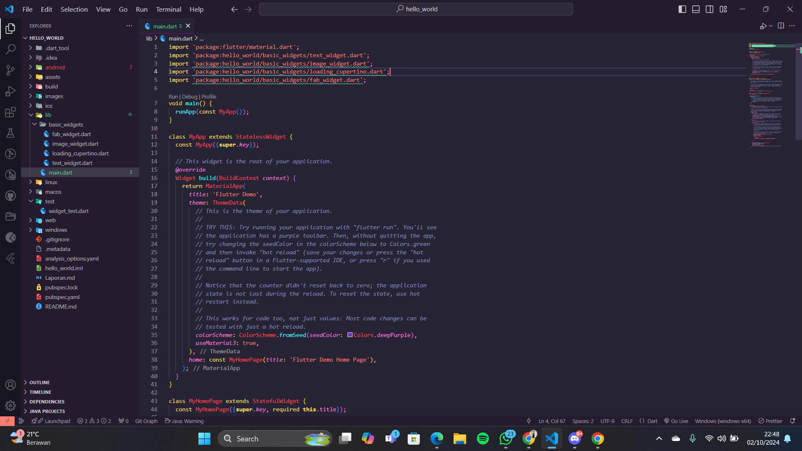

## Praktikum 2: Menghubungkan Perangkat Android atau Emulator
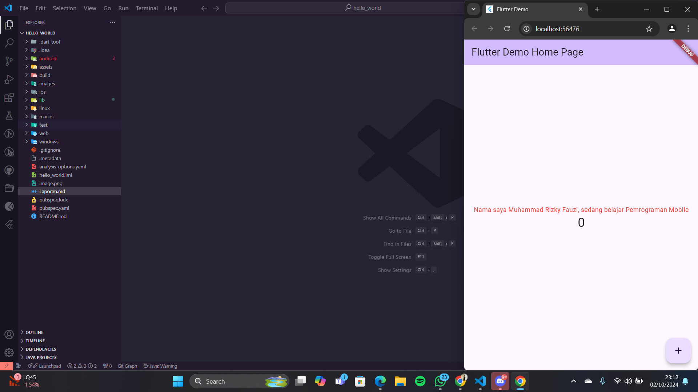

## Praktikum 3: Membuat Repository GitHub dan Laporan Praktikum
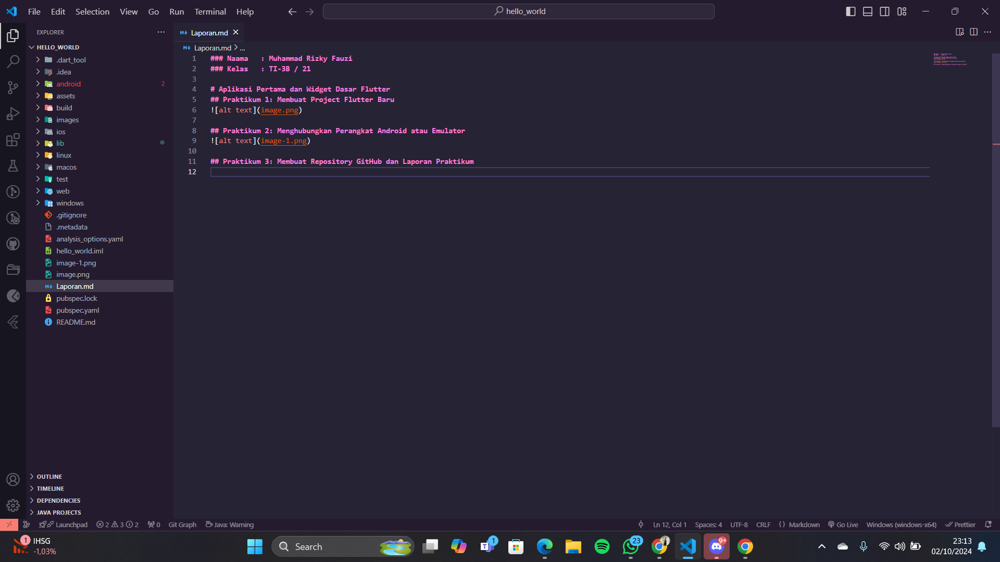

## Praktikum 4: Menerapkan Widget Dasar
### Langkah 1: Text Widget
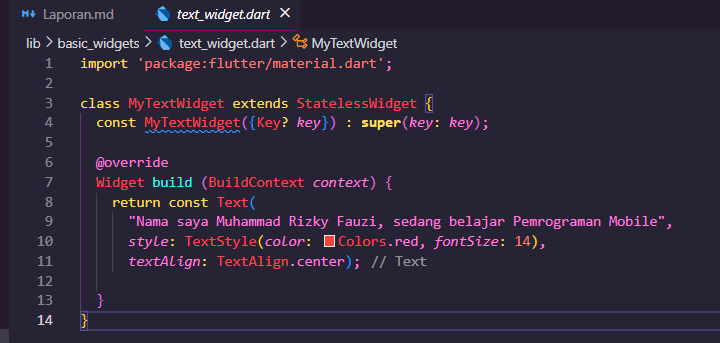        
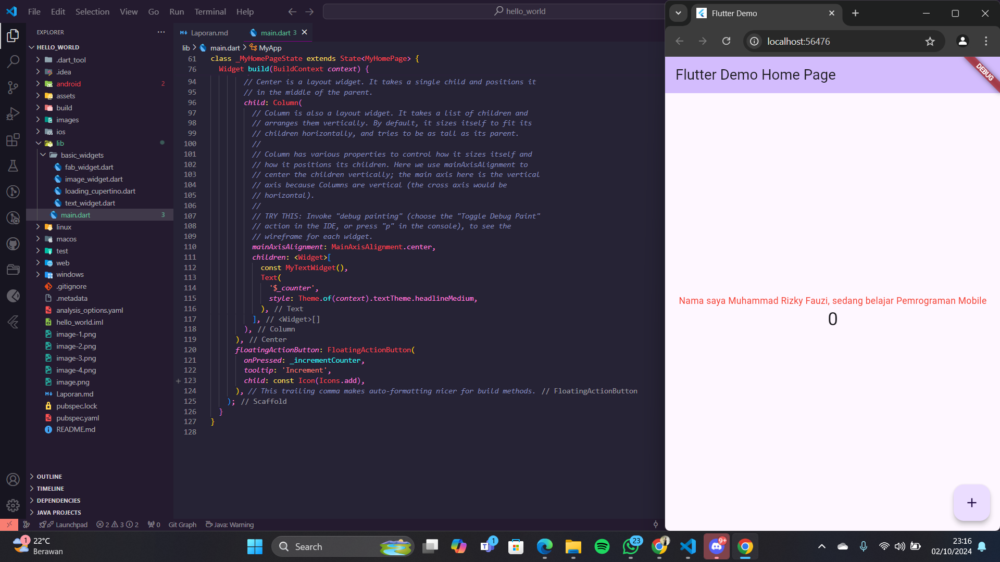        
Menampilkan sebuah text yang berisi nama saya

### Langkah 2: Image Widget
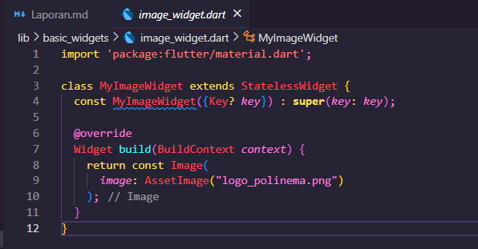
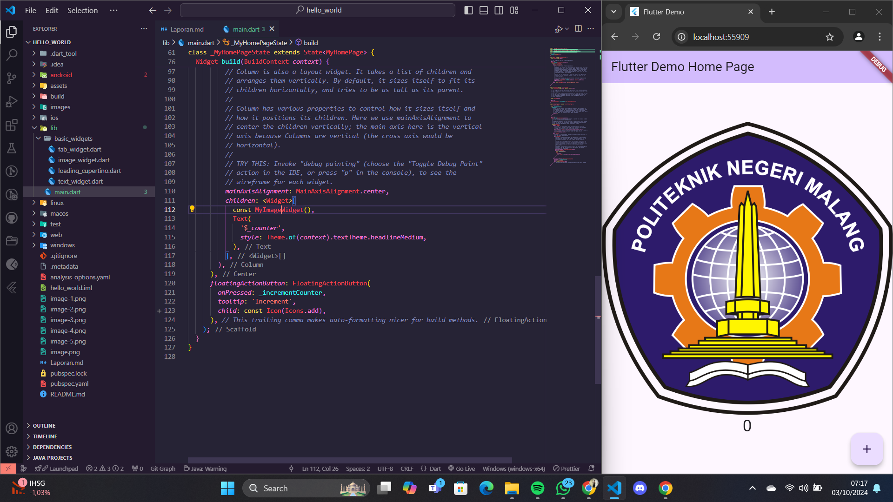        
Menampilkan logo polinema

## Praktikum 5: Menerapkan Widget Material Design dan iOS Cupertino
### Langkah 1: Cupertino Button dan Loading Bar     
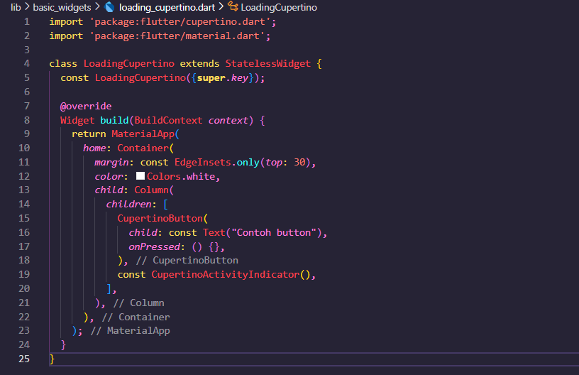
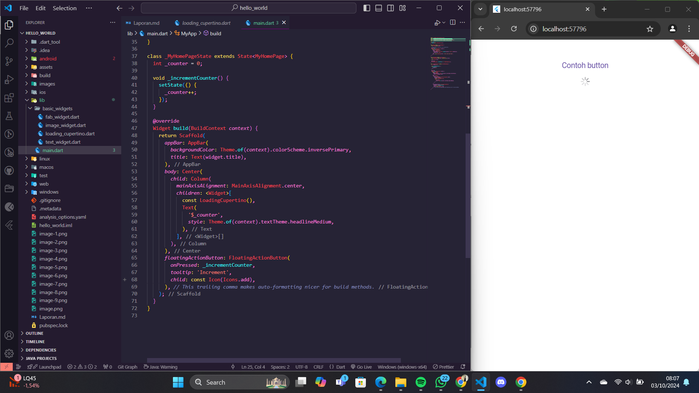       
Menampilkan contoh button loading

### Langkah 2: Floating Action Button (FAB)     
Button widget terdapat beberapa macam pada flutter yaitu ButtonBar, DropdownButton, TextButton, FloatingActionButton, IconButton, OutlineButton, PopupMenuButton, dan ElevatedButton.       
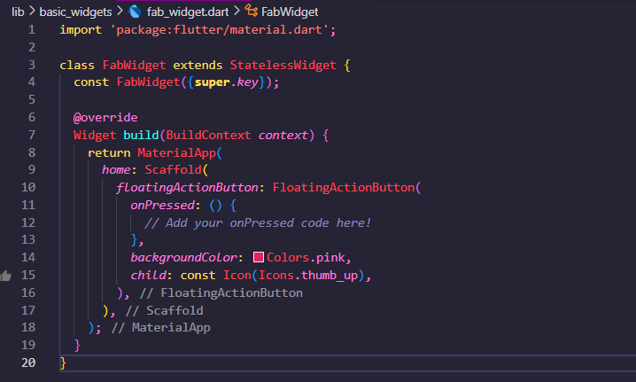
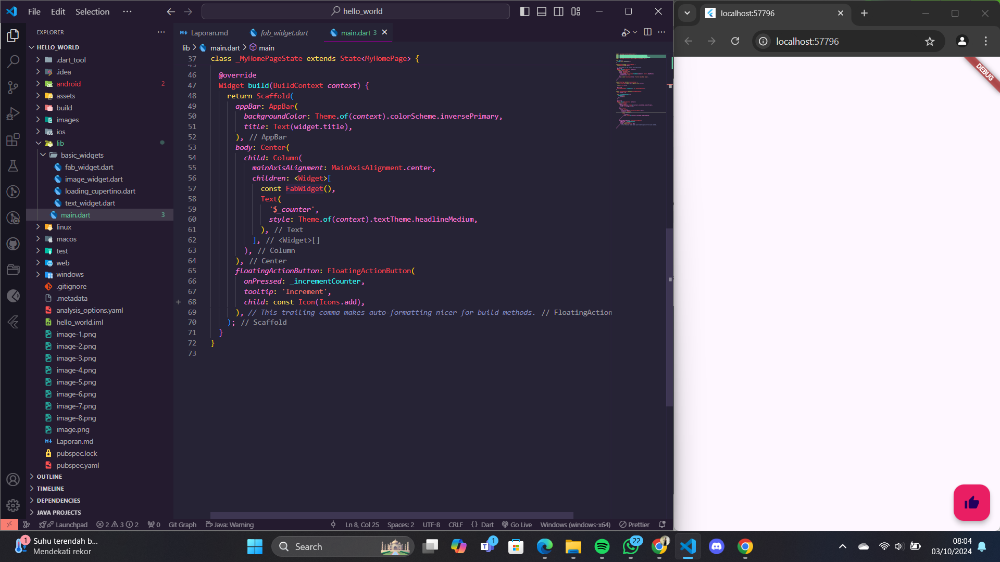

### Langkah 3: Scaffold Widget      
Scaffold widget digunakan untuk mengatur tata letak sesuai dengan material design.      
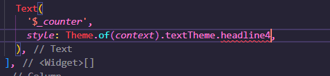       
terdapat error pada bagian tersebut dan diganti menjadi :       
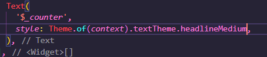

### Langkah 4: Dialog Widget        
Dialog widget pada flutter memiliki dua jenis dialog yaitu AlertDialog dan SimpleDialog.        
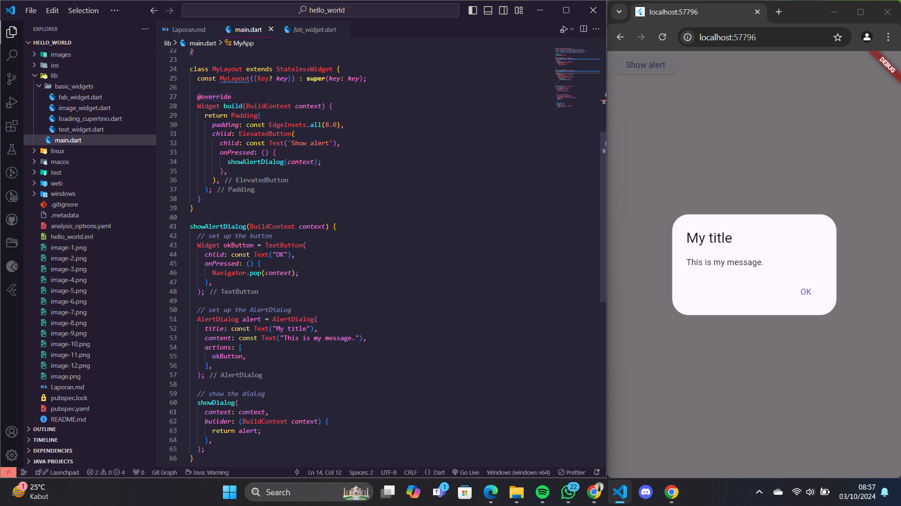

### Langkah 5: Input dan Selection Widget       
Flutter menyediakan widget yang dapat menerima input dari pengguna aplikasi yaitu antara lain Checkbox, Date and Time Pickers, Radio Button, Slider, Switch, TextField.     
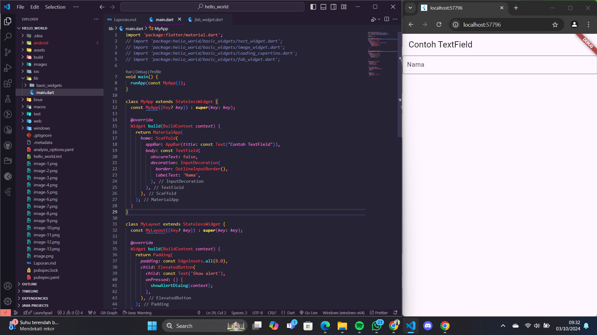

### Langkah 6: Date and Time Pickers        
Date and Time Pickers termasuk pada kategori input dan selection widget, berikut adalah contoh penggunaan Date and Time Pickers.        
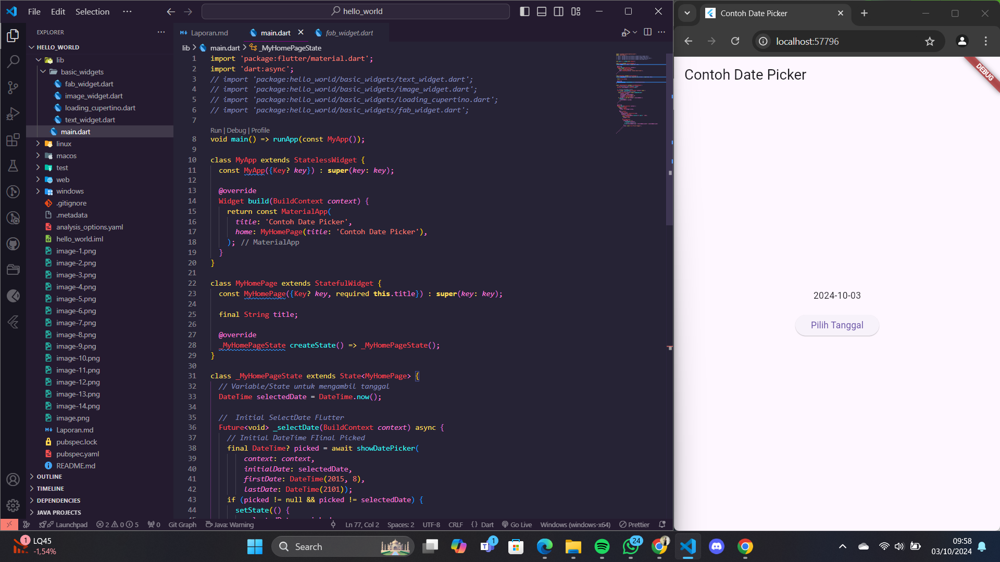
