### Nama    : Muhammad Rizky Fauzi
### Kelas    : TI-3B / 21

# Layout dan Navigasi
## Praktikum 1 Membangun Layout di Flutter
### Langkah 1

### Langkah 2
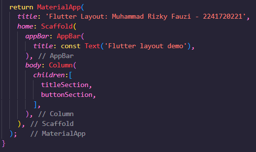

### Langkah 3
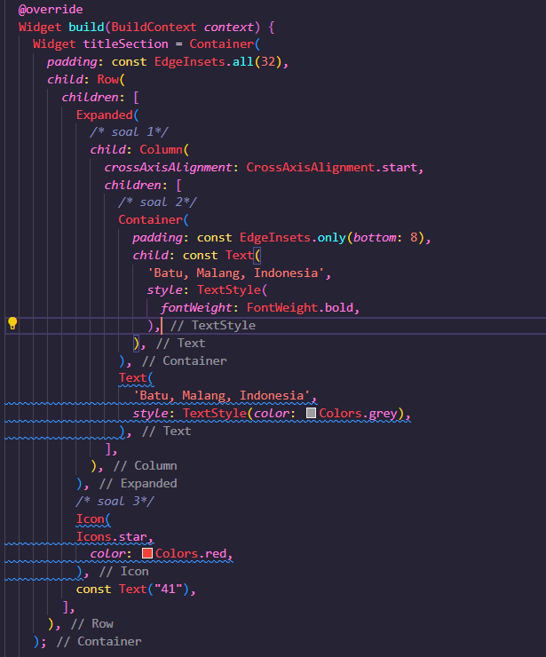

## Praktikum 2 Implementasi Button Row
### Langkah 1
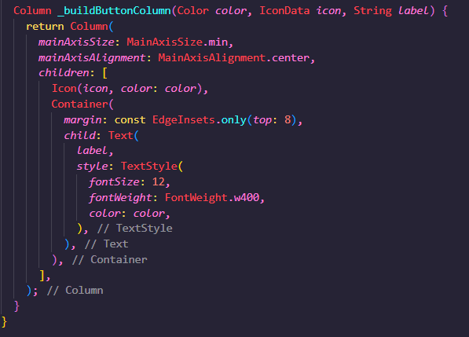

### Langkah 2
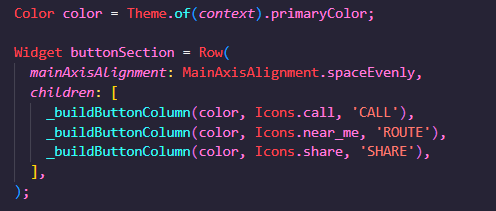

### Langkah 3
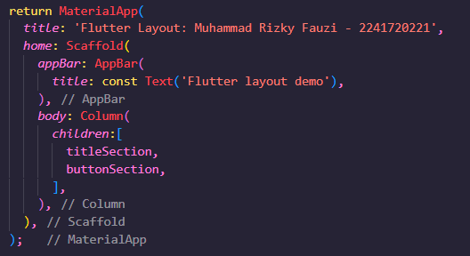

## Praktikum 3 Implementasi Text Section
### Langkah 1
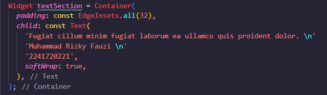

### Langkah 2
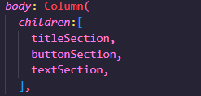

## Praktikum 4 Implementasi Image Section
### Langkah 1
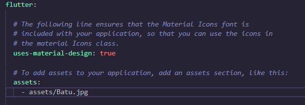

### Langkah 2

### Langkah 3

### Hasil Praktikum 1-4
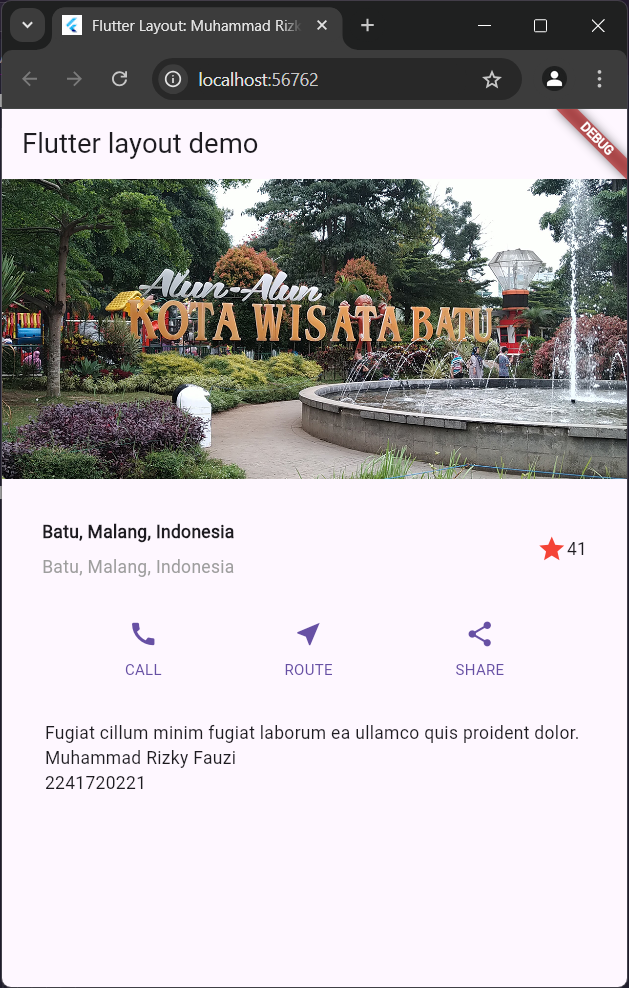

### Praktikum 5 Membangun Navigasi di Flutter
## Langkah 1
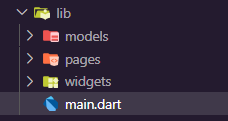

## Langkah 2
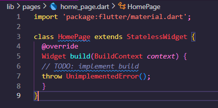

## Langkah 3
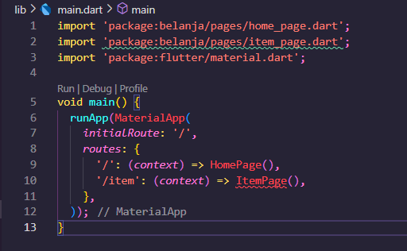

## Langkah 4
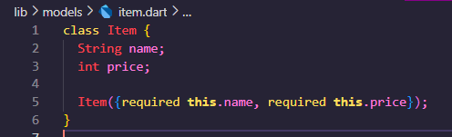

## Langkah 5
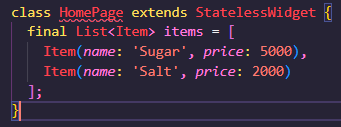

## Langkah 6
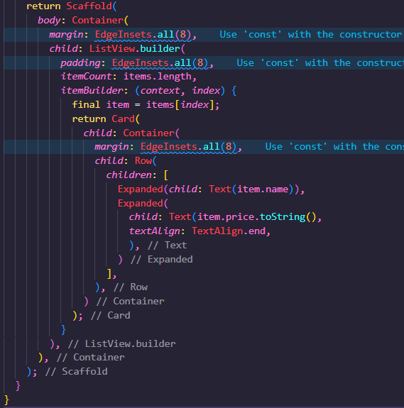

## Langkah 7
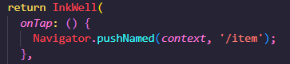

### Tugas Praktikum 2
