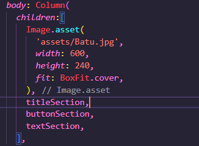

### Nama    : Muhammad Rizky Fauzi
### Kelas    : TI-3B / 21

# Layout dan Navigasi
## Praktikum 1 Membangun Layout di Flutter
### Langkah 1

### Langkah 2

### Langkah 3

## Praktikum 2 Implementasi Button Row
### Langkah 1

### Langkah 2

### Langkah 3

## Praktikum 3 Implementasi Text Section
### Langkah 1

### Langkah 2

## Praktikum 4 Implementasi Image Section
### Langkah 1

### Langkah 2

### Langkah 3

### Hasil Praktikum 1-4

### Praktikum 5 Membangun Navigasi di Flutter
## Langkah 1

## Langkah 2

## Langkah 3

## Langkah 4

## Langkah 5

## Langkah 6

## Langkah 7

### Tugas Praktikum 2
