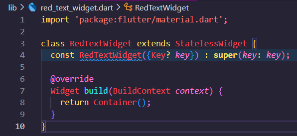

### Muhammad Rizky Fauzi
### TI-3B / 21

# 07 | Manajemen Plugin
## Praktikum 1
### Langkah 1: Buat Project Baru

### Langkah 2: Menambahkan Plugin

### Langkah 3: Buat file red_text_widget.dart

### Langkah 4: Tambah Widget AutoSizeText
        
Setelah Anda menambahkan kode di atas, Anda akan mendapatkan info error. Mengapa demikian? Jelaskan dalam laporan praktikum Anda!       
Jawab:      
Error: Undefined name 'text'. Try correcting the name to one that is defined, or defining the name.
Itu karena variabel text tidak pernah ada sebelumnya, sehingga tidak dapat dipanggil di dalam widget AutoSizeText.

### Langkah 5: Buat Variabel text dan parameter di constructor

### Langkah 6: Tambahkan widget di main.dart

### Hasil Praktikum

## Tugas Praktikum
1. Jelaskan maksud dari langkah 2 pada praktikum tersebut!      
Jawab:     
Perintah flutter pub add auto_size_text adalah perintah untuk menambahkan package auto_size_text yang berasal dari pub.dev ke dalam project. Flutter akan menambahkan auto_size_text ke dalam daftar dependencies pada pubspec.yaml, lalu kemudian akan melakukan flutter pub get secara otomatis sebagai perintah untuk mendownload package yang dibutuhkan.

2. Jelaskan maksud dari langkah 5 pada praktikum tersebut!      
Jawab:     
Menambahkan variabel text sebagai parameter dari RedTextWidget. Hal ini berarti saat RedTextWidget dipanggil, maka membutuhkan variabel text untuk dikirim.

3. Pada langkah 6 terdapat dua widget yang ditambahkan, jelaskan fungsi dan perbedaannya!       
Jawab:      
Container pertama memiliki warna Yellow Accent dan text yang berada pada child akan diresize agar muat dalam ukuran panjang 50. Sedangkan Container kedua memiliki warna Green Accent dan text yang berada pada child akan diresize agar muat dalam ukuran panjang 100.

4. Jelaskan maksud dari tiap parameter yang ada di dalam plugin auto_size_text berdasarkan tautan pada dokumentasi ini !        
Jawab:      
- key: Mengontrol bagaimana widget menggantikan widget lain di dalam pohon.
- textKey: Menetapkan kunci untuk widget Teks yang dihasilkan.
- style: Jika tidak null, gaya yang digunakan untuk teks ini.
- minFontSize: Batas ukuran teks minimum yang akan digunakan saat mengubah ukuran teks secara otomatis.
- maxFontSize: Batas ukuran teks maksimum yang akan digunakan saat mengubah ukuran teks secara otomatis.
- stepGranularity: Ukuran langkah di mana ukuran font diadaptasi ke batasan.
- presetFontSizes: Menentukan semua ukuran font yang mungkin. Penting: presetFontSizes harus dalam urutan menurun.
- group: Mensinkronkan ukuran beberapa AutoSizeText.
- textAlign: Cara teks harus disejajarkan secara horizontal.
- textDirection: Arah teks. Ini menentukan bagaimana nilai textAlign seperti TextAlign.start dan TextAlign.end diinterpretasikan.
- locale: Digunakan untuk memilih font ketika karakter Unicode yang sama dapat dirender secara berbeda, tergantung pada lokasinya.
- softWrap: Apakah teks harus dipecah pada titik pemutusan baris lunak.
- wrapWords: Apakah kata-kata yang tidak cocok dalam satu baris harus dibungkus. Defaultnya adalah true untuk berperilaku seperti Text.
- overflow: Cara menangani overflow visual.
- overflowReplacement: Jika teks meluap dan tidak cocok dengan batasnya, widget ini akan ditampilkan sebagai gantinya.
- textScaleFactor: Jumlah piksel font untuk setiap piksel logis. Juga mempengaruhi minFontSize, maxFontSize, dan presetFontSizes.
- maxLines: Jumlah maksimum baris opsional untuk teks untuk direntang.
- semanticsLabel: Label semantik alternatif untuk teks ini.