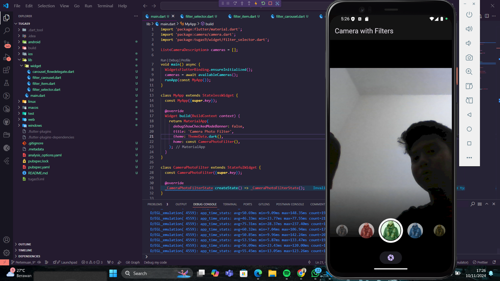

### Muhammad Rizky Fauzi
### TI-3B/21

## Hasil Gabungan Praktikum 1 & 2

### Jelaskan maksud void async pada praktikum 1?
Jawab:     
void async adalah fungsi yang berjalan secara asynchronous. async diperlukan jika kita ingin menggunakan await di dalam fungsi tersebut. await sendiri digunakan untuk menunggu operasi asynchronous selesai, seperti request API, dll. 

### Jelaskan fungsi dari anotasi @immutable dan @override?
Jawab:      
@immutable, menandakan bahwa sebuah class tidak dapat diubah (immutable) setelah dibuat. Semua field dalam class tersebut harus final. Biasanya digunakan pada class yang menyimpan state. Dapat membantu mencegah perubahan yang tidak diinginkan pada data.       
@override, menandakan bahwa method tersebut menimpa (override) method dari superclass/parent class.