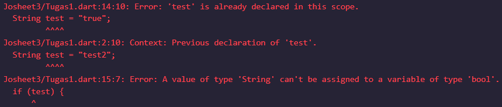

### Nama    : Muhammmad Rizky Fauzi
### Kelas   : TI-3B / 21

# Praktikum 1: Menerapkan Control Flows ("if/else")

## Langkah 1:
Ketik atau salin kode program berikut ke dalam fungsi main().
```dart
String test = "test2";
if (test == "test1") {
   print("Test1");
} else If (test == "test2") {
   print("Test2");
} Else {
   print("Something else");
}
```
```dart
if (test == "test2") print("Test2 again");
```

## Langkah 2:
Silakan coba eksekusi (Run) kode pada langkah 1 tersebut. Apa yang terjadi? Jelaskan!
```
Test2
Test2 again
```
Jawab :     
Pertama, variabel test diinisialisasi dengan nilai "test2". Program kemudian memeriksa beberapa kondisi menggunakan blok if-else if-else. Ketika memeriksa kondisi pertama (if (test == "test1")), program tidak menjalankan perintah apapun karena kondisi tersebut tidak terpenuhi. Selanjutnya, program memeriksa kondisi kedua (else if (test == "test2")), yang ternyata terpenuhi, sehingga program mencetak "Test2" ke konsol. Blok else tidak dijalankan karena kondisi sebelumnya sudah terpenuhi.

Setelah itu, program memeriksa kembali nilai test dengan pernyataan if kedua (if (test == "test2")). Karena kondisi ini juga terpenuhi, program mencetak "Test2 again" ke konsol.

Hasil akhir dari program ini adalah dua keluaran yang tercetak ke konsol: "Test2" dan "Test2 again".


## Langkah 3:
Tambahkan kode program berikut, lalu coba eksekusi (Run) kode Anda.
```dart
String test = "true";
if (test) {
   print("Kebenaran");
}
```
Apa yang terjadi ? Jika terjadi error, silakan perbaiki namun tetap menggunakan if/else.

Jawab :     
Kode diatas diganti menjadi
```dart
 bool isTrue = true;
  if (isTrue) {
    print("Kebenaran");
  }
```
Hasil :
```
Test2
Test2 again
Kebenaran
```
